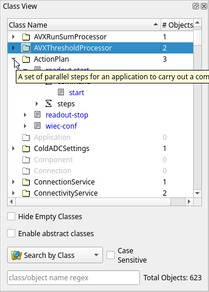
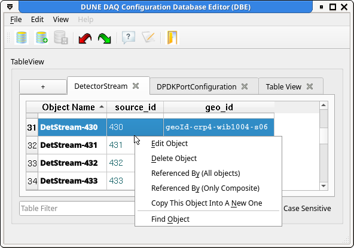

# The OKS database editor: `dbe_main`

## Prerequisite
 Before running either schemaeditor or dbe you must load the dbe spack
package with `spack load dbe`. This can have unwanted side effects
like running the wrong version of Python due to spack messing with
your PATH and LD_LIBRARY_PATH. To avoid this, keep your editing
sessions in a different window to your normal development or create an
alias /shell fucntion like:

```
function dbe_main () 
{ 
    bash -c "spack load dbe; command dbe_main $@"
}
```

## Starting the editor

 Just running the command `dbe_main` will bring up the database editor
 with no database loaded. You can then opena an existing database or
 create a new database frm the items on the File menu or the
 toolbar. If you want to specify an existing database on the command
 line, you must include the `-f` option before the name of the
 file. File names not beginning with '/' are taken to be relative to
 first the current directory, then each member of the list in
 `DUNEDAQ_DB_PATH` until a match is found.

## Navigating with the `Class view`

The `Class View` is a dockable widget originally on the left of the
main window. The`Class View` displays a list of class names and the
number of objects of that class that exist in the database. The items
in the `Class View` can be selected in the normal way with either the
mouse or the keyboard (arrow keys move up and down and open/close
lists of objects, alphabetic keys move to the first/next item starting
with that character). Activating a class name will display all
instances of the class in the current `Table View`. Opening the class
name by selecting the triangle to the left or with the right arrow
will expand the list of instances in the `Tree view`. Activating an
instance in the `Tree view` will open the `Object Editor` to edit that
instance.

Abstract classes are usually shown in grey on the `Class View` and are
not selectable. If you want to see objects of all the subclasses of an
abstract class, you can check the `Enable abstarct classes` check
box. With this selected, the abstarct classes become selectable and
activating them will show all instances of of all subclasses in the
`Table View`. **Beware** the column headings are taken from the base
class and derived classes may have more attributes/resources or a
different ordering.


Tooltips show the descriptions of the classes (assuming they have one).

To filter the list of classes to see just a subset that you are
interested in, there is a text entry field at the bottom of the `Class
View` where you can enter a regular expression to be matched against
the class names. The matching can be done on class name or object name
and case sensitive or not according to the settings of the check box
and combo box just above the text input.


## Using the `Table view`

 The `Table
View` area is a set of tabs which display the attributes and
relationships of objets in the database. A new tab can be opened by
selecting the '+' in the top left corner. The content of a tab is
selected from the `Class View` widget. Activating a class name will
add all instances of that class to the current `Table View`
tab. Activating individual instances will add only those selected to
the tab. Instances can also be dragged from the `Class View` and
dropped onto the `Table View`.

Activating a row in the `Table View` will open the `Object Editor` on
that instance. Double clicking on an attribute will allow editing of
the attribute directly in the cell and on a relationship it will pop
up a dialog box allowing selection of objects of the correct type.

Like the `Class View`, there is an edit box for an object name filter
to limit the display to only matching objects.

The `Table
 view` context menu gives you several options, allowing you to find
 all objects that refer to the current object, find an object within
 the current view by name, copy edit or delete the current object.

## Creating new objects

New objects can be created by from the `Class View` panel by using the
context menu or the shortcut `Ctrl-N` (also from the context menu in
an active `Table View` tab). This brings up the `Object Editor` for
the selected class.